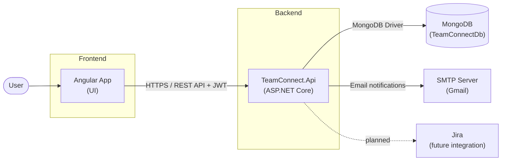

# TeamConnect - General Architecture (High-Level)

```mermaid
graph LR
    User(["User"])

    subgraph FE["Frontend"]
        Angular["Angular App\n(UI)"]
    end

    subgraph BE["Backend"]
        API["TeamConnect.Api\n(ASP.NET Core)"]
    end

    DB[("MongoDB\n(TeamConnectDb)")]
    SMTP["SMTP Server\n(Gmail)"]
    Jira["Jira\n(future integration)"]

    User --> Angular
    Angular -- "HTTPS / REST API + JWT" --> API
    API -- "MongoDB Driver" --> DB
    API -- "Email notifications" --> SMTP
    API -. "planned" .-> Jira
```
